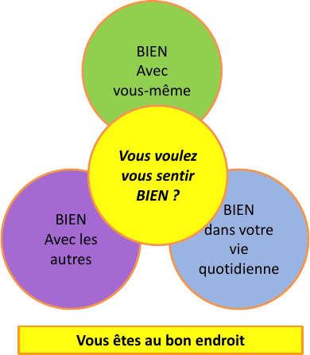

# AISAP

Axe International de Soutien et Aide Psychologique

- [Qui sommes-nous](#qui-sommes-nous)
- [Nos pratiques](#nos-pratiques)
- [Contact](#contact)

## Centre de thérapie

- Adultes ayant été victimes de maltraitance dans l’enfance
- Syndrome post traumatique
- Gestion du stress
- Troubles alimentaires
- Accroissement de la confiance en soi
- Energie et sommeil

Approche globale associant différentes techniques dans le but de restaurer la confiance en soi et dans les autres de façon durable.

## Qui sommes-nous

Créée en 2004, l’asbl A.I.S.A.P. est une initiative née de la réflexion d’un groupe de formations diverses (psychologie, psychanalyse, hypnose, sciences humaines, sociales, arts, sciences de la santé) et de la nécessité de créer un service pour les adultes ayant souffert de maltraitance dans leur enfance : abus sexuels, maltraitance physique, psychologique, négligeance .

### But

Sortir de la souffrance et de l’isolement. Restaurez la confiance en soi et dans les autres, et donner un sens à sa vie dans sa globalité corps/esprit.

## Nos pratiques

### Suivi individuel

Toute personne peut demander un suivi individuel (sans/ou avec participation au cercle de parole et ateliers).

### Cercle de parole

(6 personnes)  
« Mots à Maux » ouvre un espace qui accueille la parole sans préjugé, sans jugement et dans le respect de la personne.

### Atelier

(6 personnes)  
Auto-hypnose, le moyen le plus naturel de développer des capacités pour accéder à ses propres ressources.

## Contact

Prendre rendez-vous pour un suivi individuel  
Prendre rendez-vous pour un entretien préalable  
Avoir des informations sur le groupe de parole  

Thanh Ferretti, Coordinatrice

Tél : 0478 783 615  
Email : contact@centre-aisap.org  
www.centre-aisap.org
